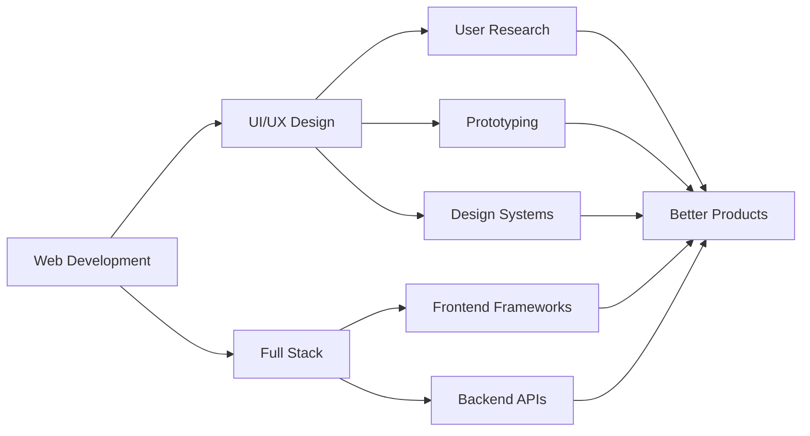

<div align="center">

# Hi, I'm Kirby Gonzales Consultado

### `UI/UX Designer` **|** `Web Developer`


</div>

---

## About Me

```typescript
const kirby = {
    location: "Taguig City, Metro Manila 🇵🇭",
    education: "Diploma in Information Technology",
    university: "Polytechnic University of the Philippines - Taguig Branch",
    currentFocus: ["UI/UX Design", "Full Stack Development"],
    lookingFor: "OJT Opportunities",
    passion: "Creating meaningful digital products that solve real-world problems"
};
```

<div align="center">

### Currently, I am:

Expanding expertise in **UI/UX Design**  
Building full-stack web applications  
Learning advanced design patterns  
Seeking **OJT opportunities** to grow and contribute

</div>

---

## Tech Arsenal

<div align="center">

### Frontend


### Backend


### Design & Tools


</div>

---

## Featured Projects

<table>
<tr>
<td width="50%">

### 🧠 MindStack
**Web Application • Productivity**

A comprehensive platform designed to make studying more effective and engaging through enhanced productivity features and intuitive UX.

`Web App` `Productivity` `UX Design`

</td>
<td width="50%">

### 🔐 Blind Vault
**Web Application • Security**

Secure banking platform enabling seamless transactions (deposits, withdrawals, transfers) with robust security measures and user-friendly interface.

`Banking` `Security` `User Experience`

</td>
</tr>
<tr>
<td width="50%">

### 🤝 YouthConnect
**Web Application • Community**

Platform connecting youth and SK Officials for local initiatives, fostering collaboration and community engagement through accessible design.

`Community` `Engagement` `Collaboration`

</td>
<td width="50%">

### 📚 Enrollment System
**Web Application • Education**

Streamlined enrollment management system for educational institutions, simplifying student registration and enrollment processes.

`Education` `Management` `Accessibility`

</td>
</tr>
</table>

---

## Learning Journey



---

## Let's Connect

<div align="center">

[](mailto:kirbyconsultado@gmail.com)
[](https://www.linkedin.com/in/kirby-consultado-3750202b3/)
[](https://web-portfolio-kirby-consultado.netlify.app/)

</div>

<div align="center">

### Open to OJT Opportunities

I'm actively seeking opportunities to contribute to real-world projects,  
collaborate with experienced professionals, and grow my skills in UI/UX design and web development.

**Let's build something amazing together!**

</div>
