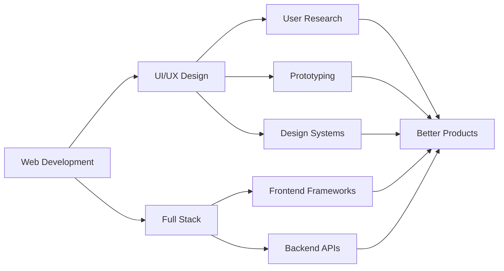

<div align="center">

# Hi, I'm  Kirby Gonzales Consultado

### `UI/UX Designer` **|** `Web Developer` **|** `Problem Solver`


</div>

---

## 🎯 About Me

```typescript
const kirby = {
    location: "Taguig City, Metro Manila 🇵🇭",
    education: "Diploma in Information Technology",
    university: "Polytechnic University of the Philippines - Taguig",
    currentFocus: ["UI/UX Design", "Full Stack Development", "User Experience"],
    lookingFor: "OJT Opportunities",
    passion: "Creating meaningful digital products that solve real-world problems",
    funFact: "I believe great design is invisible until you need it"
};
```

<div align="center">

### 🚀 Currently

🎨 Expanding expertise in **UI/UX Design**  
💻 Building full-stack web applications  
📚 Learning advanced design patterns  
🔍 Seeking **OJT opportunities** to grow and contribute

</div>

---

## 🛠️ Tech Arsenal

<div align="center">

### Frontend Magic ✨


### Backend Power ⚡


### Design & Tools 🎨


</div>

---

## 💼 Featured Projects

<table>
<tr>
<td width="50%">

### 🧠 MindStack
**Web Application • Productivity**

A comprehensive platform designed to make studying more effective and engaging through enhanced productivity features and intuitive UX.

`Web App` `Productivity` `UX Design`

</td>
<td width="50%">

### 🔐 Blind Vault
**Web Application • Security**

Secure banking platform enabling seamless transactions (deposits, withdrawals, transfers) with robust security measures and user-friendly interface.

`Banking` `Security` `User Experience`

</td>
</tr>
<tr>
<td width="50%">

### 🤝 YouthConnect
**Web Application • Community**

Platform connecting youth and SK Officials for local initiatives, fostering collaboration and community engagement through accessible design.

`Community` `Engagement` `Collaboration`

</td>
<td width="50%">

### 📚 Enrollment System
**Web Application • Education**

Streamlined enrollment management system for educational institutions, simplifying student registration and enrollment processes.

`Education` `Management` `Accessibility`

</td>
</tr>
</table>

---

## 📊 GitHub Stats

<div align="center">
  


</div>

<div align="center">
  
[](https://git.io/streak-stats)

</div>

---

## 🎨 Design Philosophy

> **"Great design is invisible. Great UX is unforgettable."**

- 🎯 **User-Centered**: Every decision starts with the user's needs
- 🔄 **Iterative Process**: Design, test, learn, improve, repeat
- ♿ **Accessibility First**: Digital experiences should be for everyone
- 🎨 **Visual Harmony**: Beauty and function working together
- 💡 **Problem Solving**: Design is about solving problems, not just making things pretty

---

## 🌱 Learning Journey



---

## 📫 Let's Connect

<div align="center">

[](mailto:kirbyconsultado@gmail.com)
[](https://www.linkedin.com/in/kirby-consultado-3750202b3/)
[](#)

</div>

<div align="center">

### 💼 Open to OJT Opportunities

I'm actively seeking opportunities to contribute to real-world projects,  
collaborate with experienced professionals, and grow my skills in UI/UX design and web development.

**Let's build something amazing together!**

</div>

---

<div align="center">

### 🎯 2024 Goals

- [ ] Complete 5+ UI/UX case studies
- [ ] Contribute to open-source design systems
- [ ] Master advanced Figma techniques
- [ ] Build a component library
- [ ] Land an amazing OJT opportunity

</div>

---

<div align="center">


**Thanks for stopping by!** 🚀


</div>
